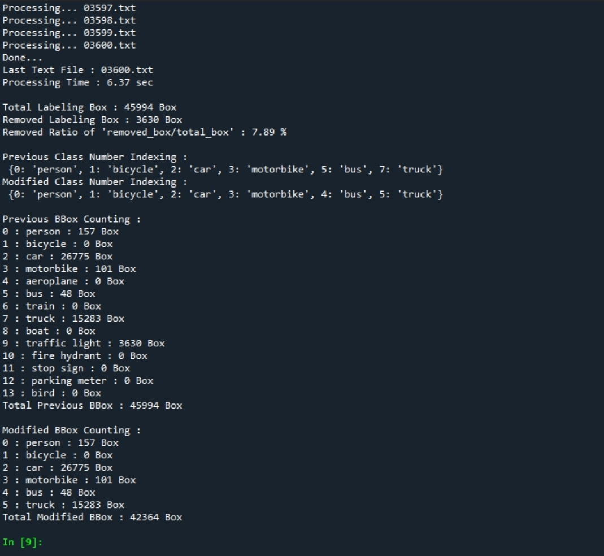

# YOLO Annotation Converter

YOLO format Annotation Converting Program. Converting text files(*.txt)


### Converting Result with Annotation Statistics

\- modified class index <br>
\- removed bbox <br>
\- mapping index 

<p align="center">

</p>

### Using Command Flags

- --path : input directory path including obj.names file
<br>`python annotation_converter.py --path [YOUR_PATH]`
- --want_class(option): if you want classes, input file path, having obj.names format. Default : person, bicycle, car, motorbike, bus, truck in MS COCO
<br>`python annotation_converter.py --path [YOUR_PATH] --want_class [YOUR_PATH]\[YOUR_WANT_CLASS_FILE_NAME].names`
- --obj_names(option) : input obj.names format file, if your obj.names format file's name is not obj.names
<br>`python annotation_converter.py --path [YOUR_PATH] --obj_names [YOUR_PATH]\[YOUR_OBJ_FILE_NAME].names`

### More Command

\- search 1 index class in txt files, located with image files.
```
grep "^1" *.txt
```
